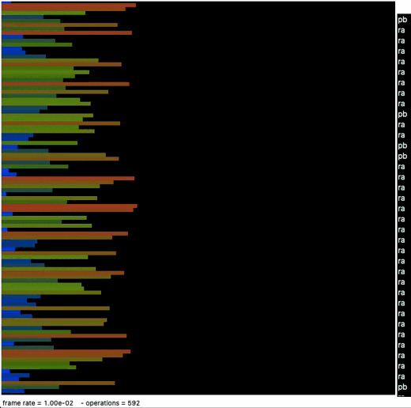

# Push Swap
This is PUSH_SWAP 42 Project. \
It's about sorting numbers by using two stacks with set of rules.
There're four different commands (usage in program):

**_Push_** – send number from one stack to another (`pa` / `pb`) \
**_Rotate_** – first number goes to the bottom and other shifts up (`ra` / `rb` / `rr`) \
**_Reverse rotate_** – last number goes to the top and other shifts down (`rra` / `rrb` / `rrr`) \
**_Swap_** – swap first two number (`sa` / `sb` / `ss`)

### Goals of project

Sort numbers with minimum command usage. \
**3 numbers** should be sorted less then **3 moves**        ––  Mine: max **2 moves** :white_check_mark: \
**5 numbers** should be sorted less then **12 moves**       ––  Mine: max **10 moves** :white_check_mark:\
**100 numbers** should be sorted less then **700 moves**    ––  Mine: max **610 moves** :white_check_mark:\
**500 numbers** should be sorted less then **5500 moves**   ––  Mine: max **5200 moves** :white_check_mark: 

### How to test

1. `make`
2. `./push_swap 3 2 1 5 4` \
    or run : \
   ./push_swap ruby -e &#96;"puts (-249..250).to_a.shuffle.join(' ')"&#96;
3. You can download a [visualizer](https://github.com/o-reo/push_swap_visualizer).

#### Example
